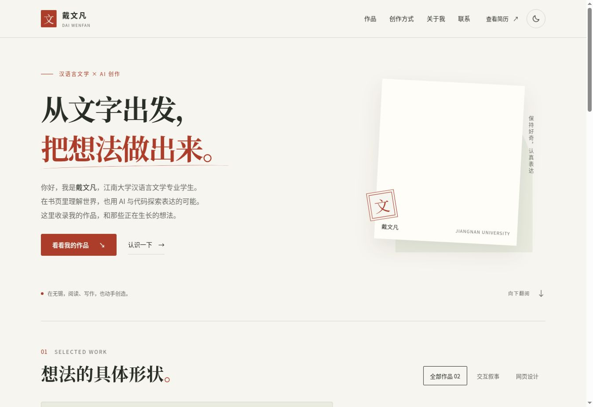

# 戴文凡 · 文学 × AI 创作

从文字出发，把想法做出来。江南大学汉语言文学学生的个人作品集，以真实项目连接文学背景与 AI 创作实践。

[浏览网站](https://fathom-rgb.github.io/dwf.github.io/) · [一页简历](https://fathom-rgb.github.io/dwf.github.io/resume.html) · [试玩大学文字模拟器](https://fathom-rgb.github.io/-/)



## 内容与设计

- **精选作品**：大学文字模拟器 UniLifeSim 与个人网站。每件作品提供入口、具体功能和可展开的实现笔记。
- **创作方式**：梳理与表达、AI 辅助实现、体验与迭代。用具体实践代替技能百分比和未经核实的效率承诺。
- **关于我**：教育背景、已有证书、阅读写作与运动摄影等个人兴趣。
- **联系**：公开版只提供邮箱与复制邮箱；证书证明材料通过邮件联系核验。
- **简历**：与首页一致的作品和定位，适合屏幕阅读及 A4 打印。

采用纸白、墨色和朱砂红配色，以书刊式标题、留白、照片与真实项目画面建立视觉层次。深色主题使用墨绿背景与暖色重点。移除粒子、打字机和技能进度条，让内容直接可见。

## 文件与运行

生产页面使用原生 HTML、CSS、JavaScript，无生产依赖，也不依赖外部字体或图标 CDN。`npm run build` 先检查页面再生成 `dist/`，仅将公开资源发布到 GitHub Pages。

| 文件 | 用途 |
| --- | --- |
| `index.html` | 首页；样式和交互分别位于 assets/styles.css 与 assets/site.js |
| `assets/motion.css`、`assets/motion.js` | 视觉增强、标题揭示、滚动渐入、照片倾斜与交互过渡 |
| `resume.html` | 简历；独立屏幕与打印样式 |
| `assets/photo.jpg` | 原有个人照片 |
| `assets/certificate.jpg` | 历史证书文件；不包含在网站发布目录中，公开仓库历史仍可能留存 |
| `assets/unilifesim.jpg` | 真实游戏截图 |
| `assets/portfolio-preview.jpg` | 本次首页预览 |
| `assets/favicon.svg` | 文字印章站点图标 |
| `scripts/serve.cjs` | 使用 Node 内置模块的开发服务器 |
| `sitemap.xml`、`robots.txt` | 索引说明 |
| `.github/workflows/pages.yml` | GitHub Pages 自动发布 |

直接打开 `index.html` 即可阅读。使用本地开发服务器时，无需安装依赖：

```bash
npm run dev
```

默认地址为 `http://127.0.0.1:4173/`。开发服务接受 `--host`、`--port` 和 `--strictPort` 参数，不参与生产运行。

## 交互与无障碍

- 首次绘制前恢复亮暗偏好；未手动选择时跟随系统主题。
- 手机导航使用原生 `dialog`，支持 Escape、焦点管理与背景滚动锁定。
- 导航链接关闭菜单后将焦点交给对应章节；切回桌面宽度时收起菜单。
- 两件作品直接展示；作品笔记使用原生 `details`。
- 剪贴板权限被拒绝或接口不可用时尝试兼容复制，并保留手动复制说明。
- 提供跳过导航、可见键盘焦点、图片描述和减少动效偏好支持。
- 页面脚本不可用时，内容和作品链接仍可用，笔记可展开。动效不使用持久隐藏样式；减少动态效果开启时取消动画，照片倾斜仅适用于鼠标设备。

## 图片与作品依据

`assets/unilifesim.jpg` 来自本人项目 [fathom-rgb/-](https://github.com/fathom-rgb/-) 的实际运行画面，截图展示“开学报到”事件；对应源码提交 `ecc856d904d67a3a13014e7f4e83fa219fbf60b3`。页面中的 8 学期、20 结局、内容/引擎/界面分层及存档功能均依据该版本源码。截图中的“小文”为演示角色。

不为尚未提供作品链接的文章、PPT 或视频虚构成果；后续有真实样本时可按现有作品结构补充。

## 改版验证

- HTML 标签、唯一 ID、页面与锚点引用、图片描述、结构化数据、站点地图和 JavaScript 语法检查通过。
- 浏览器检查桌面布局，以及 320、390、768 像素 iframe 视口中的响应式布局，未发现横向溢出；这属于布局验证，不等同于真机测试。
- 检查作品筛选、笔记展开、主题切换与刷新后保留、手机菜单关闭及焦点恢复、证书弹窗和复制反馈。
- 移除页面脚本的测试副本中，内容、原生笔记与证书链接仍可访问。
- 使用同一份打印 CSS 渲染 A4 尺寸测试页，核对单页内容高度；未依赖操作系统打印对话框验证。

## 发布与维护

合并到 `main` 后，现有 GitHub Pages 工作流发布仓库中的静态文件。确认 Actions 中的部署任务成功后，再检查线上版本。

本站是项目站点，地址为 `https://fathom-rgb.github.io/dwf.github.io/`。仓库名称不代表账户级域名；绑定自定义域名时需同步修改两页 canonical、Open Graph、结构化数据与站点地图。

`robots.txt` 位于项目子目录；搜索引擎通常读取域名根目录文件，项目站点地图也可通过站长工具提交。

更新内容时同步维护首页与简历中的教育背景、作品、证书和联系方式。新增能力陈述或结果数据前，先补充对应作品或可核实的记录。

打印简历时选择 A4、默认缩放，并关闭浏览器页眉和页脚。深色主题下会使用浅色打印样式。
